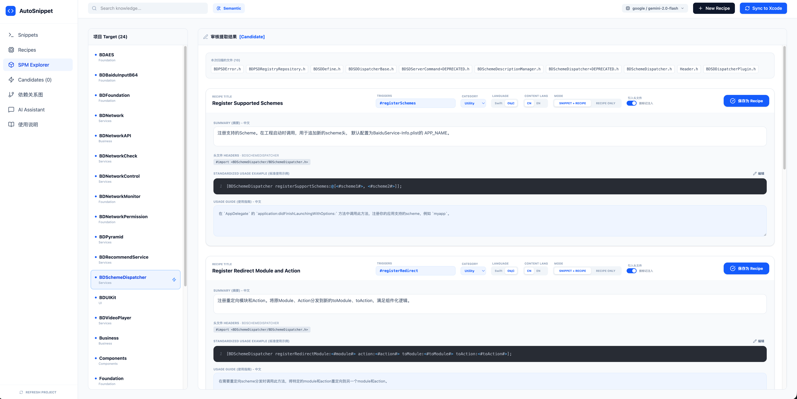
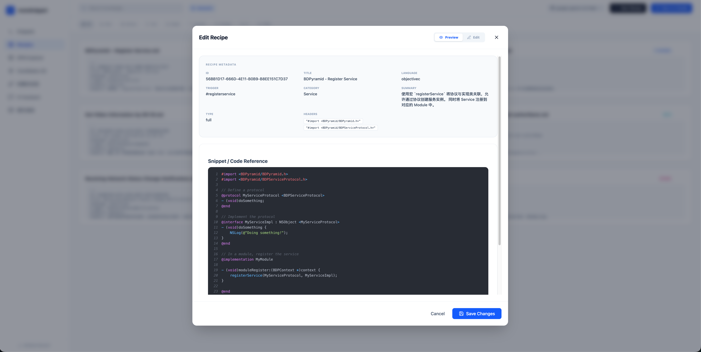
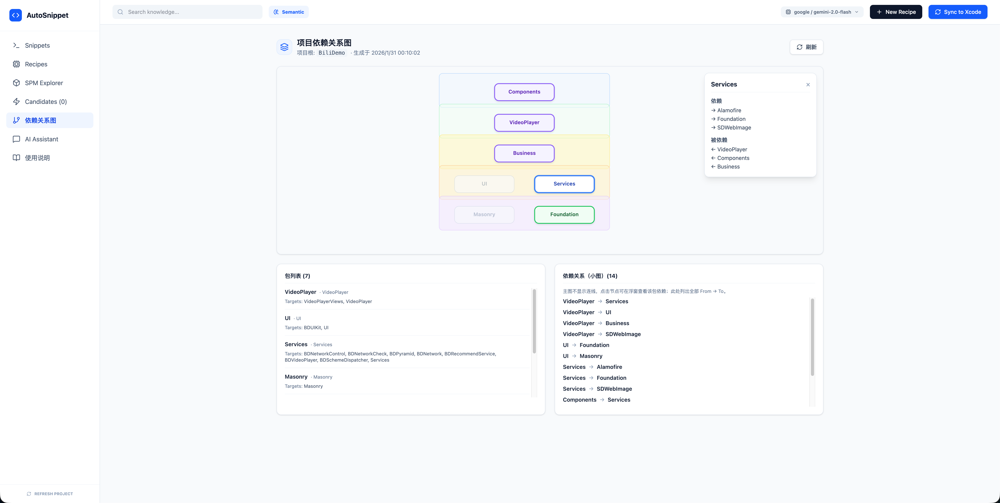

# AutoSnippet

基于 SPM 的 iOS 模块 Snippet 与 AI 知识库工具。将模块使用示范写入 Xcode CodeSnippets，支持分类检索、头文件注入，以及基于 AI 的知识沉淀与可视化管理。

开发者与 AI 生产的代码，通过人工评审之后沉淀为 Snippet + Recipe 知识库，开发者通过 Snippets 得到标准代码与依赖注入，AI 通过 Recipes 得到标准代码与项目上下文，项目被迅速解构，产出可视化交互的知识库。

[](https://www.npmjs.com/package/autosnippet)
[](https://www.npmjs.com/package/autosnippet)
[](https://github.com/GxFn/AutoSnippet/blob/main/LICENSE)

---

## 安装

```bash
npm install -g autosnippet
```

安装时默认不构建 Swift 解析器（ParsePackage），安装更快；未构建时 SPM 解析会回退到系统 `swift package dump-package` 或 AST-lite。若需优先使用 Swift 解析器，**在任意目录**执行：`asd build-parser`（或在安装时设置 `ASD_BUILD_SWIFT_PARSER=1 npm install -g autosnippet`）。

---

## 快速开始

**项目根目录**：即将在此目录创建 `AutoSnippetRoot.boxspec.json` 的目录（单仓库用仓库根即可）。后续 `asd ui`、编辑器内指令、命令行等均以此目录为基准。

在**你的业务项目根目录**执行：

```bash
# 1) 一键初始化（创建 AutoSnippetRoot.boxspec.json 等）
asd setup

# 2) 启动 Web 管理后台（会同时启动 watch，编辑器内指令才会生效）
asd ui
```

**首次运行 `asd ui`** 时，若未检测到 Dashboard 前端，会自动在 AutoSnippet 安装目录执行构建（约 1–2 分钟）。浏览器会自动打开 Dashboard，可在 **使用说明** 页查看完整说明。

### 界面预览







---

## 新项目：AI 扫描 + 人工审核 → 知识库与依赖 → 与 Cursor/AI 形成闭环

新项目在完成「快速开始」后，可按以下方式**用 AI 扫描 + 人工审核**快速组建知识库和依赖关系，再配合 Cursor 与其他 AI 形成闭环：

1. **组建知识库**：在项目根执行 **`asd ais <Target>`** 或 **`asd ais --all`**，对 SPM Target 做批量 AI 扫描；结果进入 Dashboard 的 **Candidates** 页。在 Dashboard 中逐条审核，通过则入库为 Recipe（或 Snippet+Recipe），不需要的删除。反复几轮即可把现有代码中的「标准用法」沉淀到 `Knowledge/recipes/`。

2. **组建依赖关系**：在项目根执行 **`asd spm-map`**（或 Dashboard 内刷新依赖关系图），生成 `Knowledge/AutoSnippet.spmmap.json`，供后续查阅「谁依赖谁」、模块边界。

3. **可选：语义索引**：执行 **`asd embed`**，为 Recipes 构建语义向量索引，便于 **as:guard** 语义检索、**as:search** 与 Dashboard 内语义搜索。

4. **配合 Cursor**：在项目根执行 **`asd install:cursor-skill`**，将 AutoSnippet 的 skills 安装到项目的 `.cursor/skills/`。Cursor Agent 即可获得「项目 Recipe 上下文」「依赖结构」「创建流程」等说明，按项目规范回答与改代码。

5. **闭环**：日常开发中，用 Cursor 或其他 AI 基于知识库与依赖结构写代码；写完的模块使用代码通过 **`// as:create`** 或 Dashboard **New Recipe** 提交到 web、加入知识库；用 **`// as:guard`** 按知识库做合规审查；用 **`Snippet`** 联想插入标准代码 或 **`// as:search`** 从知识库检索插入标准代码。知识库与依赖随人工审核和提交持续更新，AI 始终基于最新上下文，形成「扫描 → 审核 → 沉淀 → Cursor/AI 使用 → 再沉淀」的闭环。

---

## 编辑器内指令

在源码中写入以下 **as:** 指令并**保存**，由 **watch** 或 **CLI** 解析执行。**需先运行 `asd watch` 或 `asd ui`**（`asd ui` 会在后台启动 watch），编辑器内指令才会在保存时生效。

| 指令 | 作用 | 触发时机 |
|------|------|----------|
| **`// as:create`** | 用剪贴板 + 当前文件路径创建 Recipe，打开 Dashboard | 保存文件后 watch 检测到 |
| **`// as:guard`** [关键字] | 按知识库（Recipes）用 AI 审查当前文件，结果输出终端 | 保存文件后 watch 检测到 |
| **`// as:search`** [关键词] | 从知识库检索 Recipe/Snippet 并插入 | 保存后 watch 检测到 |
| **`// as:include`** &lt;Module/Header.h&gt; [path] | Snippet 体内的头文件标记，watch 在文件头部注入 `#import` | 保存文件后 watch 检测到 |
| **`// as:import`** ModuleName | Snippet 体内的 Swift 模块导入标记，watch 注入 `import` | 保存文件后 watch 检测到 |

### // as:create

在源码中写一行 **`// as:create`**，把要沉淀的代码**复制到剪贴板**，保存文件。watch 检测到后会**打开 Dashboard** 并带当前文件路径；若剪贴板有内容，会走「Use Copied Code」流程并自动解析头文件。适合：在编辑器里写完模块使用代码后，直接提交到 web、加入知识库。

### // as:guard

在源码中写 **`// as:guard`** 或 **`// as:guard 关键字`**，保存文件。watch 会按 **知识库（Recipes）** 用 AI 审查当前文件是否符合项目规范，**结果输出到终端**。若已执行 `asd embed`，会优先用语义检索选取相关 Recipe。

### // as:search

在源码中写 **`// as:search`** 或 **`// as:search 关键词`**，保存文件。watch 检测到后会**打开 Dashboard**，展示从知识库（Recipes）中按关键词检索到的候选；不写关键词则展示全部。在列表中点选一条 Recipe 并点击「插入」，该 Recipe 的代码块会**替换当前行**（即 `// as:search` 所在行）并写回文件，实现「选即插」。插入标准代码也可在 Xcode 中通过 **Snippet 联想（trigger 补全）** 直接选用已同步的 Snippet。

### // as:include 与 // as:import（头文件/模块标记）

用于 **Snippet 体内**（写入 `.codesnippet` 的 body），表示插入该 Snippet 时需要的头文件/模块；**watch** 在用户保存文件时，会在**文件头部**自动注入对应的 `#import` 或 `import`。

- **ObjC 头文件**：`// as:include <ModuleName/Header.h> [相对路径]`
- **Swift**：`// as:import ModuleName`

保存时可勾选「引入头文件」，会写入上述标记；在项目根运行 `asd watch`（或 `asd ui`）后，在 Xcode 中选中 Snippet 的 headerVersion 并保存，即可在文件头部注入依赖。

---

## 术语

- **Snippet**：写入 Xcode 的代码片段，通过 trigger（补全键）或库面板使用；trigger 以配置的触发符开头（默认 **@**，可通过环境变量 `ASD_TRIGGER_SYMBOL` 更换）。
- **Recipe（配方）**：存放在 `Knowledge/recipes/` 下的 Markdown 知识，供 AI 检索、Guard 审查与搜索。
- **项目根**：含 `AutoSnippetRoot.boxspec.json` 的目录。

---

## AI 支持与配置

### 当前支持的 AI

| 提供商 | 默认模型 | 说明 |
|--------|----------|------|
| **Google Gemini** | `gemini-2.0-flash` | 用于 Snippet 提取、摘要、RAG 问答等 |
| **OpenAI** | `gpt-4o` | 支持 OpenAI 标准接口 |
| **DeepSeek** | `deepseek-chat` | 深度求索系列模型 |
| **Anthropic Claude** | `claude-3-5-sonnet-20240620` | 支持 Claude 系列模型 |
| **Ollama** | `llama3` | **本地 AI 支持**，默认地址 `http://localhost:11434/v1` |

### 配置指南

**1. 必填：API Key**

在**项目根目录**创建 `.env` 文件（可复制 `.env.example`），或通过环境变量传入 API Key：

```bash
export ASD_GOOGLE_API_KEY="你的 API Key"   # 或 ASD_OPENAI_API_KEY、ASD_DEEPSEEK_API_KEY、ASD_CLAUDE_API_KEY
```

在项目根执行 `asd ai-test` 可验证当前配置是否可用。未配置时，依赖 AI 的功能会报错或提示。

**2. 可选**：`ASD_AI_PROVIDER`、`ASD_AI_MODEL`、各提供商 `_BASE_URL` 等，见项目内 `.env.example`。

**3. 可选：代理**：设置 `https_proxy` / `http_proxy` 访问外网 API。国内直连 Google/OpenAI 易失败，建议在 `.env` 中配置代理（如 `https_proxy=http://127.0.0.1:7890`）或改用国内可用的 `ASD_AI_PROVIDER=deepseek` 等。

**4. 若出现 `TypeError: fetch failed`**：多为网络/代理问题。请确认：① 在**项目根**（含 `AutoSnippetRoot.boxspec.json` 和 `.env`）执行 `asd ui`，确保 `.env` 被加载；② 国内使用 Google 时在 `.env` 中设置 `https_proxy` 与 `http_proxy`，并保证代理进程可用；③ 或改用 DeepSeek/OpenAI 等，在 `.env` 中设置 `ASD_AI_PROVIDER=deepseek` 并配置 `ASD_DEEPSEEK_API_KEY`。

**5. 切换 DeepSeek 后报「API Key is missing for provider: deepseek」**：说明当前已使用 deepseek（可能来自 boxspec 的 `ai.provider` 或 `.env` 的 `ASD_AI_PROVIDER`），但**项目根** `.env` 里未配置 Key。请在**项目根**（即运行 `asd ui` 的目录）的 `.env` 中增加一行：`ASD_DEEPSEEK_API_KEY=你的DeepSeek密钥`，保存后重启 `asd ui`。Key 仅从项目根 `.env` 读取，不会用 AutoSnippet 安装目录下的 `.env`。

---

## Cursor 集成

若使用 [Cursor](https://cursor.com) 编辑项目，可将 AutoSnippet 自带的 skills 安装到**当前项目**的 Cursor 环境（项目根 `.cursor/skills/`），让 Agent 识别 Recipe、知识库与创建流程。

在**项目根目录**执行：

```bash
asd install:cursor-skill
```

或 `npm run install:cursor-skill`（在 AutoSnippet 安装目录）。安装后重启 Cursor 或新开 Agent 对话即可生效。升级 AutoSnippet 后重新执行可更新 skill 内容。

---

## Web Dashboard（asd ui）

启动后访问 `http://localhost:3000`。**若已运行 `asd ui`，watch 会在后台启动，编辑器内指令（as:create、as:guard、头文件注入等）在保存时生效。**

- **macOS**：再次运行 `asd ui` 会复用已有 `localhost:3000` 标签并聚焦（Chromium 系浏览器）。

| 页面 | 说明 |
|------|------|
| **Snippets** | 查看、编辑、删除代码片段；同步到 Xcode |
| **Recipes** | 管理配方（Recipes）文档，与 Snippet 关联 |
| **SPM Explorer** | 按 Target 扫描源码，AI 提取候选；从路径/剪贴板创建 Recipe |
| **Candidates** | 审核 CLI 批量扫描（`asd ais`）产生的候选，入库或忽略 |
| **依赖关系图** | 展示 SPM 包依赖（packages + edges） |
| **AI Assistant** | 基于本地 Snippets/Recipes 的 RAG 问答 |
| **使用说明** | 本说明的 Web 版 |

### 新建 Recipe

- **按路径**：输入相对路径（如 `Sources/MyMod/Foo.m`）→ **Scan File** → AI 提取标题/摘要/触发键/头文件，审核后保存到 `Knowledge/recipes/`。
- **按剪贴板**：复制代码后点击 **Use Copied Code** → AI 分析并填充；若由 `// as:create` 打开会带当前文件路径，自动解析头文件。

---

## 命令行

以下命令均在**项目根目录**执行。**编辑器内指令**已在上文优先说明；此处为 CLI 能力速查与补充。

### 常用命令

| 命令 | 说明 |
|------|------|
| `asd ui` | 启动 Web Dashboard（并后台启动 watch，使编辑器内指令生效） |
| `asd watch` / `asd w` | 仅启动 watch，不打开浏览器；用于头文件注入、`// as:create`、`// as:guard` |
| `asd create --clipboard` | 从剪贴板用 AI 创建 Snippet；可选 `--path`、`--lang` |
| `asd create` | 从带 `// as:code` 的文件用 AI 提取并创建 Snippet |
| `asd install` / `asd i` | 将 Snippets 同步到 Xcode |
| `asd ais [Target]` / `asd ais --all` | AI 扫描 SPM Target，结果进 Candidates，在 Dashboard 审核 |
| `asd search [keyword]` | 关键词搜索 Snippets 与 Recipes；加 `-m` 为语义搜索（需先 `asd embed`） |
| `asd embed` | 重建语义索引；语义搜索与 Guard 语义检索依赖此命令 |
| `asd install:cursor-skill` | 将 AutoSnippet skills 安装到项目 `.cursor/skills/` |

### create 补充

- **剪贴板**：`asd create --clipboard`，可选 `asd create --clipboard --path Sources/MyMod/Foo.m`、`--lang swift`。
- **从文件**：源码中用 `// as:code` 包裹要提炼的片段，再执行 `asd create` 并选择该文件。
- **传统模式**：`asd create --no-ai`、`asd --preset preset.json create`。

### 其他命令

- `asd setup`：等价于 init + root，推荐在单仓库根执行一次。
- `asd root`：在当前目录创建/更新项目根标记（`AutoSnippetRoot.boxspec.json`）。
- `asd init`：在 SPM 模块目录创建模块工作空间。
- `asd share`：共享本地 Snippet。
- `asd u <word> [key] [value]`：按 trigger 更新 Snippet 字段。

### 全局选项

- `--preset <path>`：预置输入 JSON（非交互/自动化）。
- `--yes`：非交互；缺必要输入则报错退出。
- 环境变量：`ASD_PRESET` / `ASD_TEST_PRESET` 指定预置路径。

---

## install 之后

执行 `asd install` 后，Snippets 会同步到 Xcode 的 **Code Snippets** 库。在 Xcode 中通过触发词（completion）或库面板使用；若未生效可尝试重启 Xcode。Snippet 代码中可使用 `<#placeholder#>`，Xcode 会识别为占位符，用 Tab 切换。

---

## 贡献

欢迎提交 Issue 与 Pull Request。

## 许可证

MIT，见 [LICENSE](LICENSE).
