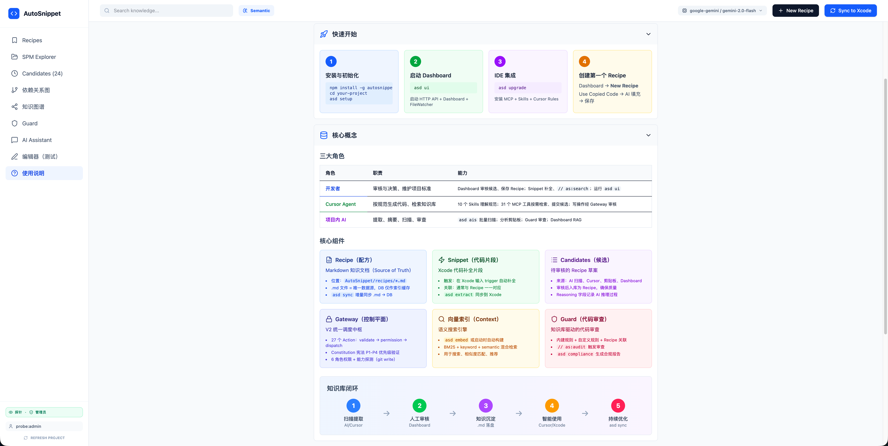

<div align="center">

# AutoSnippet

**Project Knowledge Engine for iOS / Swift Teams**

将团队的代码模式、最佳实践沉淀为 AI 可检索的知识库，<br>
让 Cursor、Copilot 和 Xcode 都按你的项目规范生成代码。

[](https://www.npmjs.com/package/autosnippet)
[](https://github.com/GxFn/AutoSnippet/blob/main/LICENSE)
[](https://nodejs.org)

</div>

---

## 为什么需要 AutoSnippet？

AI 编码助手生成的代码往往脱离项目上下文——不知道团队约定、不了解架构模式、也不遵守代码规范。AutoSnippet 在你的项目中建立一个**活的知识库**，让所有 AI 工具都能检索并遵循团队沉淀的最佳实践。

```
你的项目代码  ──→  AI 扫描提取  ──→  人工审核  ──→  知识库 (Recipe)
                                                        │
                ┌───────────────────────────────────────┘
                ↓
        Cursor / Copilot / Xcode  ──→  按规范生成代码
```

## 核心概念

| 概念 | 说明 |
|------|------|
| **Recipe** | 知识库的基本单元——一段代码模式 + 使用说明 + 元数据，存储在数据库中，可导出为 Markdown 到 `AutoSnippet/recipes/` |
| **Candidate** | 待审核的候选知识——来自 AI 扫描、手动提交或剪贴板，经 Dashboard 人工审核后晋升为 Recipe |
| **Dashboard** | Web 管理后台（`asd ui`），管理 Recipe / Candidate / Guard / 知识图谱等 |
| **Guard** | 代码审查引擎——基于知识库中的规则对代码做合规检查 |
| **Skills** | Cursor Agent 技能文件——告诉 AI 何时、如何使用 AutoSnippet 的能力 |

## 快速开始

```bash
# 1. 全局安装
npm install -g autosnippet

# 2. 在你的项目目录初始化
cd /path/to/your-project
asd setup          # 创建 AutoSnippet/ 目录，配置 VSCode / Cursor

# 3. 安装 IDE 集成（Skills + MCP + Cursor Rules）
asd install:full

# 4. 启动 Dashboard
asd ui             # 启动 Web 后台 + 文件监听 + 语义索引
```

> **注意**：始终在**你的项目目录**中执行 `asd` 命令，而非 AutoSnippet 源码仓库。

## 工作流

### 知识沉淀闭环

```
┌─────────────────────────────────────────────────────────────┐
│                                                             │
│   ① 扫描提取                        ② 人工审核             │
│   Cursor AI 扫描 Target ──→ Candidates ──→ Recipe 入库     │
│   asd ais <Target>                Dashboard                 │
│   剪贴板 / 手动提交                                         │
│                                                             │
│   ③ AI 按规范生成                    ④ 持续沉淀             │
│   Cursor/Copilot 检索 Recipe ──→ 生成代码 ──→ 好代码再入库  │
│   MCP 工具 / Xcode Snippet                                  │
│                                                             │
└─────────────────────────────────────────────────────────────┘
```

### 三种使用方式

**① Cursor AI（推荐）**：自然语言驱动，Cursor 通过 13 个 Skills + 34 个 MCP 工具与知识库交互。

```
用户：「扫描 NetworkModule 这个 Target，提取最佳实践」
Cursor → autosnippet_get_targets → autosnippet_get_target_files → 逐文件提取 → autosnippet_submit_candidates
→ Dashboard Candidates 页面审核 → 保存为 Recipe
```

**② Dashboard Web UI**：可视化管理一切——Recipe 编辑器、Candidate 审核、知识图谱、Guard 审查、冷启动向导。

**③ 命令行 CLI**：`asd` 命令覆盖全部操作，适合自动化和脚本集成。

## Dashboard

`asd ui` 启动后访问 Web 管理后台：



**主要功能**：

- **Recipes**：浏览、编辑、发布、弃用知识条目；支持代码高亮编辑器
- **Candidates**：审核 AI/手动提交的候选，一键入库或批量操作
- **知识图谱**：可视化 Recipe 之间的关系（依赖 / 扩展 / 冲突等），AI 自动发现关系，按 category 分组布局
- **Guard**：代码合规审查，查看违规记录与修复建议
- **Xcode 模拟器**：在浏览器中模拟 `as:search` / `as:create` / `as:audit` 指令
- **冷启动**：Bootstrap 向导——选择 SPM Target 逐个扫描，AI 提取代码模式生成 Candidate

## IDE 集成

### Cursor（推荐）

AutoSnippet 为 Cursor 提供完整的 MCP + Skills 集成：

- **34 个 MCP 工具**：搜索、Guard 检查、候选提交、知识图谱查询、Bootstrap 等
- **13 个 Agent Skills**：`autosnippet-candidates`、`autosnippet-guard`、`autosnippet-coldstart` 等，引导 AI 正确使用工具
- **写操作 Gateway 保护**：7 个写操作经过权限 / 宪法 / 审计三重检查

```bash
asd install:cursor-skill --mcp  # 安装 Skills + MCP 配置
```

### VSCode Copilot

```bash
asd install:vscode-copilot      # 配置 MCP 和 Copilot 指令
```

### Xcode

通过 Code Snippet 触发词（`ass` / `asc` / `asa`）+ 文件保存指令与知识库交互，详见下方 [Xcode 深度集成](#xcode-深度集成)。

```bash
asd setup              # 注册 Snippet，重启 Xcode 生效
```

## CLI 命令参考

| 命令 | 说明 |
|------|------|
| `asd setup` | 初始化项目（创建 AutoSnippet/ 目录和配置） |
| `asd ui` | 启动 Dashboard + 文件监听 + 语义索引 |
| `asd status` | 环境自检（项目根、AI、索引、Dashboard 状态） |
| `asd ais [Target]` | AI 扫描 Target → 生成 Candidates |
| `asd search <keyword>` | 搜索知识库（`--copy` 复制 / `--pick` 交互选择） |
| `asd embed` | 手动构建语义向量索引 |
| `asd spm-map` | 刷新 SPM 依赖映射 |
| `asd extract` | 同步 Snippet 到 Xcode |
| `asd sync` | 增量同步 `recipes/*.md` → DB |
| `asd compliance` | 生成宪法合规评估报告 |
| `asd upgrade` | 升级 IDE 集成文件 |
| `asd install:full` | 全量安装（Skills + MCP + Native UI） |

## 配置

### AI Provider

在项目根目录创建 `.env` 文件（参考 `.env.example`）：

```env
ASD_AI_PROVIDER=gemini          # gemini / openai / anthropic
ASD_GOOGLE_API_KEY=your-key     # Gemini API Key
```

### 项目目录结构

```
your-project/
├── AutoSnippet/              # 知识库目录（建议整体作为 Git 子仓库）
│   ├── recipes/              # Recipe Markdown 导出
│   └── .autosnippet/         # 数据库、索引、Guard 配置等
├── .cursor/
│   ├── mcp.json          # MCP 配置（asd setup 自动生成）
│   ├── rules/            # Cursor Rules（asd install 生成）
│   └── skills/           # Agent Skills（asd install 生成）
├── .vscode/
│   └── settings.json     # VSCode MCP 配置
└── .env                  # AI Provider 配置
```

### Git 策略建议

| 路径 | 建议 |
|------|------|
| `AutoSnippet/` | **整体作为 Git 子仓库**——独立权限控制，写权限探针（`git push --dry-run`）在此目录执行，仅知识管理员可 push |
| `AutoSnippet/.autosnippet/context/index/` | 加入 `.gitignore`——体积大、机器相关 |

## 架构概览

```
┌────────────────────────────────────────────────────────┐
│  IDE Layer                                             │
│  Cursor (Skills + MCP) │ VSCode (Copilot) │ Xcode     │
└────────────┬───────────────────┬───────────────────────┘
             │ MCP (stdio)       │ HTTP API
┌────────────┴───────────────────┴───────────────────────┐
│  AutoSnippet Core                                      │
│  ┌──────────┐ ┌──────────┐ ┌──────────┐ ┌───────────┐ │
│  │ Gateway  │ │ ChatAgent│ │ Bootstrap│ │ Dashboard │ │
│  │ (权限/   │ │ (ReAct + │ │ (SPM +   │ │ (React +  │ │
│  │  宪法/   │ │  DAG     │ │  AST +   │ │  Vite)    │ │
│  │  审计)   │ │  Pipeline│ │  AI)     │ │           │ │
│  └──────────┘ └──────────┘ └──────────┘ └───────────┘ │
│  ┌──────────────────────────────────────────────────┐  │
│  │  Services: Recipe │ Candidate │ Guard │ Search   │  │
│  │  Knowledge Graph │ SPM │ Indexing │ Compliance   │  │
│  └──────────────────────────────────────────────────┘  │
│  ┌──────────────────────────────────────────────────┐  │
│  │  Storage: SQLite (better-sqlite3) + 向量索引     │  │
│  └──────────────────────────────────────────────────┘  │
└────────────────────────────────────────────────────────┘
```

## 技术栈

- **Runtime**：Node.js ≥ 20，ESM
- **后端**：Express + better-sqlite3 + MCP SDK
- **前端**：React + TypeScript + Vite + Tailwind CSS
- **AI**：Gemini / OpenAI / Anthropic（通过 AiProvider 抽象层）
- **AST**：Tree-sitter（Swift / ObjC / JS / TS）
- **索引**：语义向量 + BM25 + 关键词三模式搜索

## Xcode 深度集成

AutoSnippet 不依赖 Xcode 插件，通过 **AppleScript + FileWatcher + 原生 macOS UI** 实现深度集成。

| 能力 | 说明 |
|------|------|
| **保存即触发** | FileWatcher 监听源码目录；在代码中写入 `// as:search`、`// as:create`、`// as:audit` 后按 `⌘S`，自动执行对应操作 |
| **AppleScript 自动化** | 通过 `osascript` 驱动 Xcode——行号跳转、行选中、剪切/粘贴替换、前台检测；搜索结果直接替换触发行 |
| **原生 macOS UI** | Swift 原生弹窗展示搜索结果列表（降级为 AppleScript `choose from list`）；系统通知反馈操作结果 |
| **智能 import 注入** | 插入代码时自动分析所需 `import`，检查 SPM 模块可达性，确认后通过 AppleScript 注入头文件 |
| **三层防误触** | Self-write 冷却 + 内容哈希去重 + Xcode 焦点检测，区分手动保存与自动保存 |
| **Code Snippet** | `ass`（搜索插入）、`asc`（创建候选）、`asa`（代码审查），`asd setup` 注册后重启 Xcode 生效 |

## 贡献

欢迎 [Issue](https://github.com/GxFn/AutoSnippet/issues) 与 [PR](https://github.com/GxFn/AutoSnippet/pulls)。

## License

[MIT](LICENSE)
