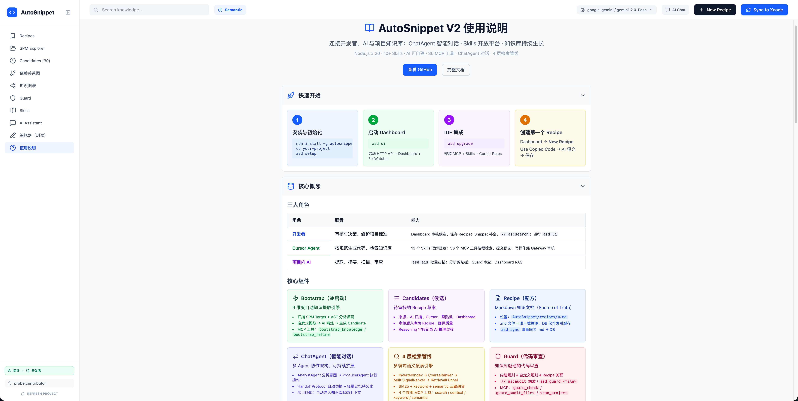

<div align="center">

# AutoSnippet

**Project Knowledge Engine for iOS / Swift Teams**

将团队的代码模式、最佳实践沉淀为 AI 可检索的知识库，<br>
让 Cursor、Trae、Copilot 和 Xcode 都按你的项目规范生成代码。

[](https://www.npmjs.com/package/autosnippet)
[](https://github.com/GxFn/AutoSnippet/blob/main/LICENSE)
[](https://nodejs.org)

</div>

---

## 为什么需要 AutoSnippet？

AI 编码助手生成的代码往往脱离项目上下文——不知道团队约定、不了解架构模式、也不遵守代码规范。AutoSnippet 在你的项目中建立一个**活的知识库**，让所有 AI 工具都能检索并遵循团队沉淀的最佳实践。

```
你的项目代码  ──→  AI 扫描提取  ──→  人工审核  ──→  知识库 (Recipe)
                                                        │
                ┌───────────────────────────────────────┘
                ↓
        Cursor / Trae / Copilot / Xcode  ──→  按规范生成代码
```

## 核心概念

| 概念 | 说明 |
|------|------|
| **Recipe** | 知识库的基本单元——一段代码模式 + 使用说明 + 元数据，存储在 SQLite 中，可导出为 Markdown 到 `AutoSnippet/recipes/` |
| **Candidate** | 待审核的候选知识——来自 AI 扫描、手动提交、剪贴板或 Bootstrap 冷启动，经 Dashboard 人工审核后晋升为 Recipe |
| **Dashboard** | Web 管理后台（`asd ui`），10 个功能视图：Recipes / Candidates / AI Chat / SPM Explorer / 知识图谱 / 依赖图 / Guard / Skills / Xcode 模拟器 / Help |
| **Guard** | 代码审查引擎——基于知识库中的规则对代码做合规检查，支持文件 / Target / 项目三级范围 |
| **Skills** | 13 个 Cursor Agent 技能包——覆盖候选生成、冷启动、Guard 审计、意图路由、生命周期管理等场景 |
| **Bootstrap** | 冷启动引擎——自动扫描 SPM Target + AST 分析，9 维度启发式提取代码模式，AI 精炼后生成 Candidate |
| **ChatAgent** | 多 Agent 协作对话系统（Analyst + Producer），支持项目感知、信心信号、组合工具链和跨对话轻量记忆 |

## 快速开始

```bash
# 1. 全局安装
npm install -g autosnippet

# 2. 在你的项目目录初始化
cd /path/to/your-project
asd setup          # 创建 AutoSnippet/ 目录，配置 VSCode / Cursor

# 3. 安装 IDE 集成（Skills + MCP + Cursor Rules）
asd install:full

# 4. 启动 Dashboard
asd ui             # 启动 Web 后台 + 文件监听 + 语义索引

# 5. 检查环境状态
asd status         # 自检项目根、AI Provider、索引、Dashboard
```

> **注意**：始终在**你的项目目录**中执行 `asd` 命令，而非 AutoSnippet 源码仓库。

## 工作流

### 知识沉淀闭环

```
┌─────────────────────────────────────────────────────────────┐
│                                                             │
│   ① 扫描提取                        ② 人工审核             │
│   Cursor AI 扫描 Target ──→ Candidates ──→ Recipe 入库     │
│   asd ais <Target>                Dashboard                 │
│   Bootstrap 冷启动 / 剪贴板                                 │
│                                                             │
│   ③ AI 按规范生成                    ④ 持续沉淀             │
│   Cursor/Copilot 检索 Recipe ──→ 生成代码 ──→ 好代码再入库  │
│   MCP 工具 / Xcode Snippet                                  │
│                                                             │
└─────────────────────────────────────────────────────────────┘
```

### 三种使用方式

**① Cursor AI（推荐）**：自然语言驱动，Cursor 通过 13 个 Skills + 38 个 MCP 工具与知识库交互。

```
用户：「扫描 NetworkModule 这个 Target，提取最佳实践」
Cursor → autosnippet_get_targets → autosnippet_get_target_files → 逐文件提取 → autosnippet_submit_candidates
→ Dashboard Candidates 页面审核 → 保存为 Recipe
```

**② Dashboard Web UI**：可视化管理一切——Recipe 编辑、Candidate 审核、AI Chat 对话、知识图谱、SPM 探索、Guard 审查、冷启动向导。

**③ 命令行 CLI**：`asd` 命令覆盖全部操作，适合自动化和脚本集成。

## Dashboard

`asd ui` 启动后访问 Web 管理后台（默认 http://127.0.0.1:3000）：



**10 个功能视图**：

| 视图 | 说明 |
|------|------|
| **Recipes** | 浏览、编辑、发布、弃用知识条目；详情抽屉支持 Markdown 编辑与关联关系管理 |
| **Candidates** | 审核 AI / 手动提交的候选，一键入库或批量操作，支持 AI 润色 |
| **AI Chat** | ChatAgent 智能对话（Analyst 分析 + Producer 生产），项目感知 + 跨对话记忆 |
| **SPM Explorer** | SPM Target 浏览与扫描，候选 vs Recipe 对比抽屉，头文件编辑 |
| **Dep Graph** | 依赖关系图可视化 |
| **Knowledge Graph** | Recipe 关联关系的知识图谱可视化（依赖 / 扩展 / 冲突等），AI 自动发现关系，按 category 分组 |
| **Guard** | 代码合规审查，查看违规记录与修复建议 |
| **Skills** | 浏览与管理 Agent Skill 文档 |
| **Xcode Simulator** | 在浏览器中模拟 `as:search` / `as:create` / `as:audit` 指令 |
| **Help** | 使用帮助与快捷键参考 |

**辅助功能**：全局搜索面板、LLM 配置弹窗、Bootstrap 进度视图、实时 WebSocket 更新。

## IDE 集成

### Cursor（推荐）

AutoSnippet 为 Cursor 提供完整的 MCP + Skills 集成：

- **38 个 MCP 工具**：搜索（4 种模式）、Guard 检查、候选提交 / 校验 / 查重、知识图谱查询、Bootstrap 冷启动、Skills 管理等
- **13 个 Agent Skills**：`autosnippet-candidates`、`autosnippet-guard`、`autosnippet-coldstart`、`autosnippet-intent` 等，引导 AI 正确使用工具
- **写操作 Gateway 保护**：9 个写操作经过权限 / 宪法 / 审计三重检查

```bash
asd install:cursor-skill --mcp  # 安装 Skills + MCP 配置
```

### Trae

Trae 原生支持 MCP 协议，可直接复用 AutoSnippet 的 38 个 MCP 工具：

1. 在 Trae 的 MCP 设置中添加 AutoSnippet Server：

```json
{
  "mcpServers": {
    "autosnippet": {
      "command": "node",
      "args": ["<autosnippet-install-path>/bin/mcp-server.js"],
      "env": { "ASD_PROJECT_ROOT": "/path/to/your-project" }
    }
  }
}
```

2. 或运行安装命令后手动配置：

```bash
asd install:cursor-skill --mcp  # 生成 MCP 配置，Trae 可复用同一配置格式
```

> Trae 的 MCP 配置格式与 Cursor 兼容，安装后即可使用全部工具与 Skills。

### VSCode Copilot

```bash
asd install:vscode-copilot      # 配置 MCP 和 Copilot 指令
```

### Xcode

通过 Xcode Code Snippet 触发：

| 触发关键词 | 作用 |
|-----------|------|
| `ass` | 搜索知识库并插入代码（最快捷的联想方式） |
| `asc` | 创建候选——打开 Dashboard 或从剪贴板静默提交 |
| `asa` | 按知识库审查当前代码 |

> 执行 `asd setup` 注册 Snippet 后，需**重启 Xcode** 才生效。

## CLI 命令参考

| 命令 | 说明 | 常用选项 |
|------|------|----------|
| `asd setup` | 初始化项目（创建 AutoSnippet/ 目录和配置） | `--force`、`--seed` |
| `asd ui` | 启动 Dashboard + API 服务 | `-p <port>`、`-b`（浏览器）、`--api-only` |
| `asd status` | 环境自检（项目根、AI、索引、Dashboard 状态） | — |
| `asd ais [target]` | AI 扫描 Target → 生成 Candidates | `-m <max-files>`、`--dry-run`、`--json` |
| `asd search <query>` | 搜索知识库 | `-t <type>`、`-m <mode>`（keyword/bm25/semantic）、`-l <limit>` |
| `asd guard <file>` | 对文件运行 Guard 规则检查 | `-s <scope>`（file/target/project）、`--json` |
| `asd watch` | 启动文件监控（`as:c` / `as:s` / `as:a` 指令） | `-e <exts>`、`--guard` |
| `asd server` | 单独启动 API 服务器 | `-p <port>`、`-H <host>` |
| `asd sync` | 增量同步 `recipes/*.md` → DB（Markdown = Source of Truth） | `--dry-run`、`--force` |
| `asd upgrade` | 升级 IDE 集成（MCP / Skills / Cursor Rules） | `--skills-only`、`--mcp-only` |
| `asd install:full` | 全量安装（Skills + MCP + Native UI + Cursor Rules） | — |

## MCP 工具一览

38 个 MCP 工具按功能分组：

| 分类 | 工具 |
|------|------|
| **系统** | `autosnippet_health`、`autosnippet_capabilities` |
| **搜索** | `autosnippet_search`（统合入口）、`autosnippet_context_search`（4 层漏斗）、`autosnippet_keyword_search`、`autosnippet_semantic_search` |
| **Recipe 浏览** | `autosnippet_list_recipes`、`autosnippet_get_recipe`、`autosnippet_list_rules`、`autosnippet_list_patterns`、`autosnippet_list_facts`、`autosnippet_recipe_insights`、`autosnippet_confirm_usage` |
| **候选管理** | `autosnippet_validate_candidate`、`autosnippet_check_duplicate`、`autosnippet_submit_candidate`、`autosnippet_submit_candidates`、`autosnippet_submit_draft_recipes`、`autosnippet_enrich_candidates` |
| **知识图谱** | `autosnippet_graph_query`、`autosnippet_graph_impact`、`autosnippet_graph_path`、`autosnippet_graph_stats` |
| **项目结构** | `autosnippet_get_targets`、`autosnippet_get_target_files`、`autosnippet_get_target_metadata` |
| **Guard** | `autosnippet_guard_check`、`autosnippet_guard_audit_files`、`autosnippet_scan_project` |
| **冷启动** | `autosnippet_bootstrap_knowledge`、`autosnippet_bootstrap_refine` |
| **Skills** | `autosnippet_list_skills`、`autosnippet_load_skill`、`autosnippet_create_skill`、`autosnippet_delete_skill`、`autosnippet_update_skill`、`autosnippet_suggest_skills` |
| **治理** | `autosnippet_compliance_report` |

## 配置

### AI Provider

在项目根目录创建 `.env` 文件（参考 `.env.example`）：

```env
ASD_AI_PROVIDER=gemini          # gemini / openai / anthropic
ASD_GOOGLE_API_KEY=your-key     # Gemini API Key
# ASD_OPENAI_API_KEY=your-key   # OpenAI API Key
# ASD_ANTHROPIC_API_KEY=your-key # Claude API Key
```

支持的 AI Provider：**Gemini**（推荐）、**OpenAI**、**Claude (Anthropic)**。

### 项目目录结构

```
your-project/
├── AutoSnippet/              # 知识库目录（建议整体作为 Git 子仓库）
│   ├── recipes/              # Recipe Markdown 导出（Source of Truth）
│   ├── skills/               # 项目级 Agent Skills
│   └── .autosnippet/         # 数据库、索引、Guard 配置等
├── .cursor/
│   ├── mcp.json              # MCP 配置（asd setup 自动生成）
│   ├── rules/                # Cursor Rules（asd install 生成）
│   └── skills/               # Agent Skills（asd install 生成）
├── .vscode/
│   └── settings.json         # VSCode MCP 配置
└── .env                      # AI Provider 配置
```

### Git 策略建议

| 路径 | 建议 |
|------|------|
| `AutoSnippet/` | **整体作为 Git 子仓库**——独立权限控制，写权限探针（`git push --dry-run`）在此目录执行，仅知识管理员可 push |
| `AutoSnippet/.autosnippet/context/index/` | 加入 `.gitignore`——体积大、机器相关 |

## 架构概览

```
┌──────────────────────────────────────────────────────────┐
│  IDE Layer                                               │
│  Cursor (Skills + MCP) │ VSCode (Copilot) │ Xcode        │
└────────────┬────────────────────┬─────────────────────────┘
             │ MCP (stdio)        │ HTTP API
┌────────────┴────────────────────┴─────────────────────────┐
│  AutoSnippet Core                                         │
│  ┌──────────┐ ┌──────────┐ ┌──────────┐ ┌─────────────┐  │
│  │ Gateway  │ │ ChatAgent│ │ Bootstrap│ │  Dashboard  │  │
│  │ (权限/   │ │ (Dual    │ │ (SPM +   │ │  (React 19 +│  │
│  │  宪法/   │ │  Agent + │ │  AST +   │ │   Vite 6 +  │  │
│  │  审计)   │ │  Memory) │ │  AI)     │ │   Tailwind) │  │
│  └──────────┘ └──────────┘ └──────────┘ └─────────────┘  │
│  ┌────────────────────────────────────────────────────┐   │
│  │  13 Services: Recipe │ Candidate │ Guard │ Search  │   │
│  │  Knowledge Graph │ SPM │ Bootstrap │ Chat │ Skills  │   │
│  │  Quality │ Context │ Automation │ Snippet           │   │
│  └────────────────────────────────────────────────────┘   │
│  ┌────────────────────────────────────────────────────┐   │
│  │  Core: Gateway │ Constitution │ Permission │ AST   │   │
│  │  Session │ Capability                              │   │
│  └────────────────────────────────────────────────────┘   │
│  ┌────────────────────────────────────────────────────┐   │
│  │  Storage: SQLite (better-sqlite3) + 向量索引       │   │
│  │  Search: InvertedIndex → CoarseRanker →            │   │
│  │          MultiSignalRanker → RetrievalFunnel       │   │
│  └────────────────────────────────────────────────────┘   │
└───────────────────────────────────────────────────────────┘
```

## 技术栈

| 层级 | 技术 |
|------|------|
| **Runtime** | Node.js ≥ 20，ESM |
| **后端** | Express + better-sqlite3 + MCP SDK + Socket.IO |
| **前端** | React 19 + TypeScript 5 + Vite 6 + Tailwind CSS 4 |
| **AI** | Gemini / OpenAI / Claude（通过 AiProvider 抽象层） |
| **AST** | Tree-sitter（Swift / ObjC） |
| **搜索** | 4 层检索管线：InvertedIndex → CoarseRanker → MultiSignalRanker → RetrievalFunnel |
| **实时通信** | WebSocket（Socket.IO），Dashboard 实时更新 |
| **动画** | Framer Motion |
| **代码高亮** | Prism.js + react-syntax-highlighter |

## Xcode 深度集成

AutoSnippet 不依赖 Xcode 插件，通过 **AppleScript + FileWatcher + 原生 macOS UI** 实现深度集成。

| 能力 | 说明 |
|------|------|
| **保存即触发** | FileWatcher 监听源码目录；在代码中写入 `// as:search`、`// as:create`、`// as:audit` 后按 `⌘S`，自动执行对应操作 |
| **AppleScript 自动化** | 通过 `osascript` 驱动 Xcode——行号跳转、行选中、剪切/粘贴替换、前台检测；搜索结果直接替换触发行 |
| **原生 macOS UI** | Swift 原生弹窗展示搜索结果列表（降级为 AppleScript `choose from list`）；系统通知反馈操作结果 |
| **智能 import 注入** | 插入代码时自动分析所需 `import`，检查 SPM 模块可达性，确认后通过 AppleScript 注入头文件 |
| **三层防误触** | Self-write 冷却 + 内容哈希去重 + Xcode 焦点检测，区分手动保存与自动保存 |
| **Code Snippet** | `ass`（搜索插入）、`asc`（创建候选）、`asa`（代码审查），`asd setup` 注册后重启 Xcode 生效 |

## 开发

```bash
# 克隆仓库
git clone https://github.com/GxFn/AutoSnippet.git
cd AutoSnippet
npm install

# 链接开发版到全局
npm run dev:link

# 运行测试
npm test                    # 全部测试
npm run test:unit           # 单元测试
npm run test:integration    # 集成测试
npm run test:e2e            # 端到端测试
npm run test:coverage       # 覆盖率报告

# 构建 Dashboard
npm run build:dashboard

# 发布
npm run release:check       # 发布前检查
npm run release:patch       # 补丁版本
```

## 贡献

欢迎 [Issue](https://github.com/GxFn/AutoSnippet/issues) 与 [PR](https://github.com/GxFn/AutoSnippet/pulls)。

## License

[MIT](LICENSE)
