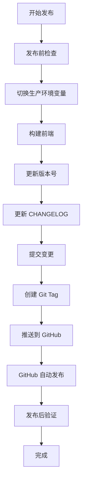

# AutoSnippet AI 发布指南

> **目标受众**：AI Agent（GitHub Copilot、Cursor、Claude 等）  
> **用途**：指导 AI 执行 AutoSnippet 的标准化发布流程  
> **版本**：v2.0（2026-02-05）

---

## 📋 发布流程总览



**预计耗时**：10-15 分钟  
**关键原则**：每步验证通过后再执行下一步，遇错立即停止  
**发布方式**：通过 Git Tag 触发 GitHub 自动发布，无需手动 npm publish

---

## 🎯 发布任务清单

### Phase 1: 发布前准备（Pre-Release）

#### 1.1 环境检查
```bash
# 确认当前分支为 main
git branch --show-current

# 确认工作区干净（无未提交变更）
git status

# 确认本地与远程同步
git pull origin main

# 确认 Node.js 版本（>=16）
node -v
```

**期望输出**：
- 当前分支：`main`
- 工作区状态：`nothing to commit, working tree clean`
- Node.js：`v16.x.x` 或更高

**修复方案**：
- 如有未提交变更 → 先 commit 或 stash
- 如不在 main 分支 → `git checkout main`
- 如有冲突 → 解决冲突后再发布

---

#### 1.2 运行完整测试
```bash
# 单元测试
npm run test:unit
切换生产环境变量

```bash
# 备份当前 .env
cp .env .env.backup

# 切换到生产配置
# 方式1：手动编辑 .env
# 将 NODE_ENV=development 改为 NODE_ENV=production
# 将 VITE_API_BASE_URL=http://localhost:3100 改为生产 URL

# 方式2：使用环境变量文件覆盖（如果有 .env.production）
cp .env.production .env
```

**关键环境变量**：
- `NODE_ENV=production`
- `VITE_API_BASE_URL`：前端 API 基础 URL
- 其他生产配置（根据项目需要）
5 其他
---
Native UI
npm run build:native-ui

# 验证构建产物
ls -lh resources/native-ui/native-ui
```

**期望输出**：
- `resources/native-ui/native-ui` 文件存在且为可执行文件

**修复方案**：
- 如构建失败 → 检查编译错误，修复后重新构建

---

#### 1.4 运行
# 集成测试
npm run test:integration

# 全量测试
npm test

# MCP 健康检查
npm run diagnose:mcp
```

**期望输出**：所有测试通过，无失败用例

**修复方案**：
- 如有测试失败 → 修复后重新测试
- 如 MCP 诊断失败 → 检查 MCP 配置和端口

---

#### 1.3 构建检查
```bash
# 构建 Dashboard
npm run build:dashboard

# 构建 Native UI
npm run build:native-ui

# 验证构建产物
ls -lh dashboard/dist/index.html
ls -lh resources/native-ui/native-ui
```

**期望输出**：
- `dashboard/dist/` 目录存在且包含 `index.html`
- `resources/native-ui/native-ui` 文件存在且为可执行文件

**修复方案**：
- 如构建失败 → 检查编译错误，修复后重新构建
- 如产物缺失 → 检查构建脚本配置

---

### Phase 2: 版本管理（Versioning）

#### 2.1 确定版本号
根据变更类型确定新版本号（遵循 [Semantic Versioning](https://semver.org/lang/zh-CN/)）：

- **Major（x.0.0）**：破坏性变更（API 不兼容）
- **Minor（1.x.0）**：新增功能（向后兼容）
- **Patch（1.7.x）**：Bug 修复（向后兼容）

**示例判断**：
- 新增 MCP tool → Minor
- 修复 Dashboard 显示问题 → Patch
- 修改 Recipe 必填字段（破坏兼容性）→ Major

**当前版本**：`1.7.0`（从 `package.json` 读取）

---

#### 2.2 更新版本号
```bash
# Patch 版本（1.7.0 → 1.7.1）
npm version patch

# Minor 版本（1.7.0 → 1.8.0）
npm version minor

# Major 版本（1.7.0 → 2.0.0）
npm version major
```

**自动行为**：
- 更新 `package.json` 中的 `version` 字段
- 创建 Git commit（message: `v1.7.1`）
- 创建 Git tag（`v1.7.1`）

**⚠️ 注意**：此步骤会自动提交，请确保工作区干净！

---

#### 2.3 更新 CHANGELOG.md

**操作**：在 `CHANGELOG.md` 顶部添加新版本条目

**模板**：
```markdown
## [1.7.1] - 2026-02-05

### 新增
- 新功能描述

### 修复
- Bug 修复描述

### 改进
- 性能/体验优化

### 文档
- 文档更新

### 废弃
- 不再推荐的功能
```

**内容来源**：
1. 从最近的 Git commits 提取变更（`git log v1.7.0..HEAD --oneline`）
2. 从 PR 标题和描述提取关键变更
3. 参考 Issue 关闭记录

**原则**：
- 面向用户（不是开发者）
- 突出影响（破坏性变更置顶）
- 清晰分类（Added/Fixed/Changed/Deprecated/Removed/Security）

---

### Phase 3: 发布执行（Release）

#### 3.1 提交 CHANGELOG
```bash
# 添加 CHANGELOG 变更
git add CHANGELOG.md

# 提交（修正 npm version 自动生成的 commit）
git commit --amend -m "chore: release v1.7.1"

# 强制更新 tag（指向新 commit）
git tag -f v1.7.1
```

**⚠️ 注意**：`--amend` 会修改历史，确保未推送到远程！

---

#### 3.2 提交构建产物和环境变量

```bash
# 添加所有发布相关变更
git add .
git status  # 确认变更内容

# 提交（修正 npm version 自动生成的 commit）
git commit --amend -m "chore: release v1.7.1"

# 强制更新 tag（指向新 commit）
git tag -f v1.7.1
```

**⚠️ 注意**：
- `--amend` 会修改历史，确保未推送到远程！
- 确认 dist/ 等构建产物已包含在提交中
- 确认 .env 已切换为生产配置

---

#### 3.3 推送到 GitHub（触发自动发布）

```bash
# 推送代码和标签
git push origin main --tags

# 或分开推送
git push origin main
git push origin v1.7.1
```

**期望输出**：
```
To github.com:user/AutoSnippet.git
 * [new tag]         v1.7.1 -> v1.7.1
```

**自动发布流程**：
- GitHub 检测到新 tag 
- 自动触发 GitHub Actions（如配置）或 Release 创建
- npm 包自动发布（通过 CI/CD）

---

### Phase 4: 发布后操作（Post-Release）

#### 4.1 恢复开发环境变量

```bash
# 恢复开发配置
cp .env.backup .env

# 或手动修改
# NODE_ENV=development
# VITE_API_BASE_URL=http://localhost:3100

# 验证
cat .env | grep NODE_ENV
```

---

#### 4.2 创建 GitHub Release

**手动创建 GitHub Release**（推荐）：
1. 访问 https://github.com/{username}/AutoSnippet/releases/new
2. 选择 tag：`v1.7.1`
3. Release title：`v1.7.1`
4. Description：从 `CHANGELOG.md` 复制对应版本的变更内容
5. 勾选 `Set as the latest release`（如为正式版）
6. 点击 `Publish release`

**或使用 GitHub CLI**：
```bash
gh release create v1.7.1 --title "v1.7.1" --notes-file <(sed -n '/## \[1.7.1\]/,/## \[/p' CHANGELOG.md | head -n -1)
```

---

#### 4.3 验证发布

```bash
# 检查 GitHub Release
open "https://github.com/{username}/AutoSnippet/releases"

# 检查 npm 包（GitHub Actions 自动发布后）
npm view autosnippet version
```

---

#### 4.4 通知相关方

**内部通知**：
- 更新项目 README（如有重大变更）
- 通知团队成员升级版本
- 更新 Cursor/VSCode Copilot Skills（如有 Skills 变更）

**外部通知**（可选）：
- 发布推特/社交媒体公告
- 更新官网文档
- 通知依赖此包的项目维护者

---

## 🚨 异常处理

### 发布失败回滚

**场景 1：推送前发现问题**
```bash
# 删除本地 tag
git tag -d v1.7.1

# 回退 commit
git reset --soft HEAD~1

# 恢复开发环境
cp .env.backup .env

# 修复问题后重新执行发布流程
```

**场景 2：推送后发现严重 Bug**
```bash
# 立即发布修复版本
npm version patch  # → 1.7.2

# 更新 CHANGELOG 标注问题
# 执行完整发布流程

# 在 GitHub Release 中标注已知问题
```

**场景 3：错误推送到 GitHub**
```bash
# ⚠️ 仅在未被他人拉取前使用！
git push origin :refs/tags/v1.7.1  # 删除远程 tag
git push origin main --force       # 强制更新（慎用）
```

**场景 4：环境变量未切换**
```bash
# 如果生产环境错误，立即回滚
git revert HEAD
git push origin main

# 修复配置后重新发布
```

---

## 📚 参考资源

- **语义化版本规范**：https://semver.org/lang/zh-CN/
- **Keep a Changelog**：https://keepachangelog.com/zh-CN/1.0.0/
- **GitHub Releases**：https://docs.github.com/cn/repositories/releasing-projects-on-github

---

## ✅ 发布检查清单（Checklist）

发布前逐项勾选：

- [ ] **环境检查**
  - [ ] 在 `main` 分支
  - [ ] 工作区干净
  - [ ] 已同步远程最新代码
  - [ ] Node.js 版本符合要求
  
- [ ] **测试验证**
  - [ ] 环境配置**
  - [ ] 切换到生产环境变量
  - [ ] 备份当前 .env 文件
  
- [ ] **测试验证**
  - [ ] 单元测试通过
  - [ ] 集成测试通过
  - [ ] MCP 诊断通过
  
- [ ] **构建验证**
  - [ ] Dashboard 前端构建成功
  - [ ] Native UI 构建成功
  - [ ] 构建产物完整
  
- [ ] **版本管理**
  - [ ] 确定新版本号
  - [ ] 执行 `npm version`
  - [ ] 更新 CHANGELOG.md
  - [ ] 提交变更并更新 tag
  
- [ ] **发布执行**
  - [ ] 检查所有文件已提交
  - [ ] 推送代码和 tag 到 GitHub
  - [ ] 确认 GitHub Actions 触发
  
- [ ] **发布后操作**
  - [ ] 恢复开发环境变量
  - [ ] 创建 GitHub Release
  - [ ] 验证 npm 包已发布

---

## 🤖 AI Agent 使用说明

**当用户说"发布新版本"或"release"时**：

1. **首先询问版本类型**：
   ```
   请确认发布类型：
   - Major（破坏性变更）
   - Minor（新增功能）
   - Patch（Bug 修复）
   当前版本：1.7.0，建议升级到？
   ```

2. **逐步执行检查清单**：
   - 提醒切换生产环境变量
   - 每完成一个 Phase，输出简要总结
   - 每遇到错误，立即停止并报告
   - 要求用户确认关键步骤（如推送到 GitHub）

3. **使用结构化输出**：
   ```
   ✅ Phase 1 完成 - 发布前准备
   ⏳ Phase 2 进行中 - 切换环境变量...
   ✅ Phase 3 完成 - 前端构建成功
   ❌ Phase 4 失败 - 工作区不干净
   ```

4. **发布完成后提供摘要**：
   ```
   🎉 发布成功！
   
   版本：v1.7.1
   GitHub：https://github.com/user/AutoSnippet/releases/tag/v1.7.1
   
   ⚠️ 重要：记得恢复开发环境变量！
   下一步：创建 GitHub Release 并通知团队
   ```

---

## 📝 变更日志

- **v2.0（2026-02-05）**：初始版本，基于 AutoSnippet 1.7.0 发布流程
